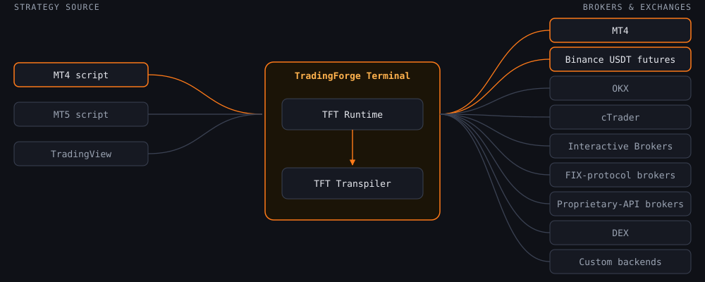

<!-- BANNER: drag a wide PNG (about 1280x320) into any GitHub issue comment, then paste here the
     user-attachments URL GitHub gives you. Do NOT commit large images to the repo - git history
     cannot be cleaned afterwards. -->
<!--  -->

# TradingForge Terminal

**Keep your trading script. Change everything behind it.**

[](https://github.com/TradingForge/TFT-releases/releases/latest)
[](https://github.com/TradingForge/TFT-releases/releases)
[](#requirements)
[](#known-limitations)

Your trading strategy shouldn't be locked to the platform it was built for. Traders and developers often
have working MQL EAs, but moving them to another broker, exchange, or asset class means rewriting code,
maintaining bridges, running additional terminals, and accepting extra points of failure.

**TradingForge Terminal removes that platform lock-in.** Write your strategy once, keep the MQL logic you
already trust, and run it across brokers, exchanges, and trading APIs through a single execution layer —
without MT4/MT5 terminals or fragile third-party bridges in the middle.

**One strategy. Multiple markets. Direct execution.**

---

## How it works

TFT lets you run your existing MQL EAs across different brokers, exchanges, and trading APIs — without
rewriting them. Your MQL strategy is transformed into executable C# and run by the **TFT Runtime**, while
the execution layer connects it to the broker, exchange, or API you choose.

```
MQL EA script (.mq4)  =>  TFT Transpiler  =>  C# EA script  =>  TFT Runtime  =>  Execution venue
```

Your EA on top, the C# the Transpiler generates below — the C# is the code TFT actually compiles and runs:

```cpp
// MaCross.mq4 — your EA
void OnTick()
{
   double fast = iMA(NULL, 0, FastPeriod, 0, MODE_EMA, PRICE_CLOSE, 1);
   double slow = iMA(NULL, 0, SlowPeriod, 0, MODE_EMA, PRICE_CLOSE, 1);

   if (fast > slow && OrdersTotal() == 0)
      OrderSend(Symbol(), OP_BUY, Lots, Ask, 3, 0, 0, "MaCross", 0, 0, clrGreen);
}
```

<div align="center"><strong>⬇ transpiled to C# ⬇</strong></div>

```csharp
// MaCross.cs — generated by the TFT Transpiler
public new void __F_OnTick()
{
    mql_double fast = iMA(NULL, 0.Mql(), __V_19, 0.Mql(), MODE_EMA, PRICE_CLOSE, 1.Mql());
    mql_double slow = iMA(NULL, 0.Mql(), __V_20, 0.Mql(), MODE_EMA, PRICE_CLOSE, 1.Mql());
    if ((mql_bool)((bool)(fast > slow) && (bool)(OrdersTotal() == 0.Mql())))
        OrderSend(Symbol(), OP_BUY, __V_21, __G_Ask, 3.Mql(), /* … */ clrGreen);
}
```

Your source is compiled, not interpreted, and the MQL4 standard library is implemented natively — so the
same EA that ran in MetaTrader runs here, against brokers MetaTrader never supported. Strategy scripts feed
the runtime, which routes orders to whichever venue you connect:

<div align="center">
  
</div>

Highlighted in amber = available now (MT4, Binance USDT futures); the rest are planned or in development.

---

## Download

| | |
|---|---|
| **64-bit** (recommended) | [**TFT-Setup-x64.exe**](https://github.com/TradingForge/TFT-releases/releases/latest/download/TFT-Setup-x64.exe) |
| **32-bit** | [**TFT-Setup-x86.exe**](https://github.com/TradingForge/TFT-releases/releases/latest/download/TFT-Setup-x86.exe) |

Installs for the current user, no administrator rights. Take the 64-bit build unless your Expert Advisors
`#import` a **32-bit DLL** — those need the 32-bit build. Both can be installed side by side.

The Terminal offers new versions itself (*Help → Check for updates*).

---

## Getting Started

1. Launch TFT Terminal
2. Add your trading account
3. Log in to the account
4. Add your MQL EA to the Navigator
5. Run the EA with your preferred settings

No additional software, no MetaTrader terminal and no bridges.

<!-- SCREENSHOT: the main window with the Runtime grid and a couple of advisors running.
     Drop it into an issue comment and paste the URL here. -->
<!--  -->
<!-- VIDEO: GitHub plays an .mp4 inline when a user-attachments URL sits on its own line.
     Until then, link a YouTube video as a clickable thumbnail:
     [](PASTE_YOUTUBE_URL) -->

## Why still run MQL script through TFT

- **Multiple accounts at once** — one terminal driving several MT4 accounts in parallel (coming soon).
- **Performance** — your EAs are compiled to native code, not interpreted; more on this in a later note.
- **Extra timeframes** — chart periods beyond MetaTrader 4's fixed set.
- **Broker + feed separation** — trade on your MT4 broker while taking quotes from a separate data feed
  (see *Roadmap*).

## Roadmap

- Multiple accounts at once, each with its own Expert Advisors.
- Exchange-native stop-loss / take-profit on Binance (placed as real orders on the exchange).
- More broker connectors.
- Charting — a built-in price chart to view bars, draw objects, and plot indicators on-chart.
- Linux and macOS support.
- MetaTrader 5 (MQL5) support — compile and run your MQL5 Expert Advisors and indicators, the way MQL4
  works today (parsing MQL5 source, not just connecting to an MT5 broker).
- Data feeds — pair a trading account with a separate market-data feed (trade on one broker, take quotes
  from another).
- Linked accounts (copy-trading) — a signal on one account enters or exits the same trade across many
  linked accounts at once, in the same millisecond.

## Requirements

- Windows 10 version 1809 (build 17763) or later, or Windows 11
- **.NET 10 Desktop Runtime** — Setup installs it automatically if it is missing
- ~130 MB of disk space
- An account with a supported broker

## Known limitations

- **Source code only (`.mq4`), not compiled `.ex4`.** The Terminal compiles the original MQL4 source, so
  you need the `.mq4` file. Pre-compiled `.ex4` binaries (for example from the MetaTrader Market, or
  protected/encrypted Expert Advisors) cannot be loaded — there is no decompilation.
- **Binance stop-loss / take-profit are handled by the Terminal, not by the exchange.** S/L and T/P are
  watched locally and the position is closed by the Terminal when price reaches the level. They are
  **not** placed as native orders on Binance yet — so they only work while the Terminal is running and
  connected to the account. Exchange-side placement is coming in a future version (see *Roadmap*).
  (MetaTrader 4 accounts use the broker's own native S/L and T/P.)
- **One account at a time.** The Terminal connects to and trades a single broker account. Running several
  accounts side by side is coming soon.
- **Windows only** (Windows 10 1809+ / Windows 11). Use the 64-bit build — it is the recommended one for
  everyone. The 32-bit build is only needed if an Expert Advisor `#import`s an old 32-bit DLL that cannot
  be recompiled for 64-bit; otherwise stay on 64-bit.

## Tips

- **Everything stays on your PC.** TFT operates no server and the Terminal sends us nothing — no telemetry,
  no analytics, no account registration. Your credentials, positions, trade history, Expert Advisors and
  logs live only in the Terminal's `Workdir` on your own machine; API keys and passwords are stored
  encrypted and are never uploaded anywhere. The Terminal connects to the network only for your own
  broker/exchange, update checks, and any notifications you configure yourself. (Full detail: SECURITY.md.)
- Your Expert Advisors, indicators and libraries live in `Workdir\MQL4`. They are kept across updates and
  are **never** removed on uninstall.
- Never share your `accounts.dat`, API keys or API secrets. Log files contain no keys, but they do contain
  account names and server addresses.

## Getting help

- **Something is broken** → [open an issue](https://github.com/TradingForge/TFT-releases/issues)
- **A question, an idea, or showing what you built** → [Discussions](https://github.com/TradingForge/TFT-releases/discussions)
- **What's not done yet (known limitations & roadmap)** → [NOTES.md](NOTES.md)
- **What changed per version** → [CHANGELOG.md](CHANGELOG.md) and the [releases](https://github.com/TradingForge/TFT-releases/releases)

> ⚠️ Issues and Discussions are public. **Never paste API keys, API secrets, passwords or your
> `accounts.dat`.** Log files contain no keys, but they do contain account names and server addresses.

## Legal

Copyright © TradingForge. All rights reserved. This software is proprietary: licensed for use, not for
redistribution, resale, repackaging or modification.

Trading involves substantial risk of loss and is not suitable for every investor. Automated trading can
lose money faster than manual trading. You are responsible for what your Expert Advisors do.
