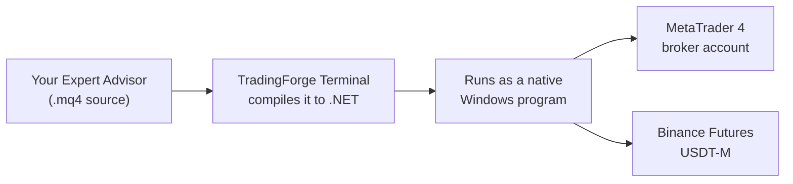

<!-- BANNER: drag a wide PNG (about 1280x320) into any GitHub issue comment, then paste here the
     user-attachments URL GitHub gives you. Do NOT commit large images to the repo - git history
     cannot be cleaned afterwards. -->
<!--  -->

# TradingForge Terminal

**Run your MQL4 Expert Advisors on modern brokers — without MetaTrader.**

[](https://github.com/TradingForge/TFT-releases/releases/latest)
[](https://github.com/TradingForge/TFT-releases/releases)
[](#requirements)
[](#status)

TradingForge Terminal is a MetaTrader-terminal replacement for Windows. It takes the `.mq4` sources you
already have, compiles them, and runs them against modern broker APIs — so an Expert Advisor written for
MetaTrader 4 can trade a crypto futures account without being rewritten.

---

## Download

| | |
|---|---|
| **64-bit** (recommended) | [**TFT-Setup-x64.exe**](https://github.com/TradingForge/TFT-releases/releases/latest/download/TFT-Setup-x64.exe) |
| **32-bit** | [**TFT-Setup-x86.exe**](https://github.com/TradingForge/TFT-releases/releases/latest/download/TFT-Setup-x86.exe) |

Installs for the current user, no administrator rights. Take the 64-bit build unless your Expert Advisors
`#import` a **32-bit DLL** — those need the 32-bit build. Both can be installed side by side.

---

<!-- SCREENSHOT: the main window with the Runtime grid and a couple of advisors running.
     Same trick as the banner: drop it into an issue comment and paste the URL. -->
<!--  -->

## How it works



Your source is compiled, not interpreted, and the MQL4 standard library is implemented natively — so the
same EA that ran in MetaTrader runs here, against brokers MetaTrader never supported.

## What you get

- **Your existing EAs, unchanged.** Drop the `.mq4` in, compile, attach it to an account.
- **Indicators too**, including the built-in ones (MA, RSI, MACD, Stochastic, ADX…) and `iCustom`.
- **Several accounts and brokers at once**, each with its own advisors, in one window.
- **No MetaTrader installation required** — the Terminal talks to brokers directly.
- **Built-in updates**: the Terminal checks for new versions and installs them itself.

## Brokers

| Broker | Trading | Quotes | History |
|---|---|---|---|
| MetaTrader 4 (any MT4 broker) | yes | yes | yes |
| Binance Futures USDT-M (live + testnet) | yes | yes | yes |

More connectors are in development.

<!-- VIDEO: GitHub plays an .mp4 inline when a user-attachments URL sits on its own line.
     Until then, link a YouTube video as a clickable thumbnail:
     [](PASTE_YOUTUBE_URL) -->

## Requirements

- Windows 10 version 1809 (build 17763) or later, or Windows 11
- **.NET 10 Desktop Runtime** — Setup installs it automatically if it is missing
- ~130 MB of disk space
- An account with a supported broker

## Installing and updating

**Update** — the Terminal offers new versions itself (*Help → Check for updates*). Your accounts,
settings and Expert Advisors are kept.

**Uninstall** — removes the program but deliberately **keeps `Workdir\MQL4`**, so your own Expert
Advisors, indicators and libraries are never deleted. Stored credentials and logs are removed.

> **Windows SmartScreen** may warn about an unknown publisher: the installer is not code-signed yet.
> Choose *More info → Run anyway*, or verify the download against
> [SHA256SUMS.txt](https://github.com/TradingForge/TFT-releases/releases/latest/download/SHA256SUMS.txt):
> ```powershell
> Get-FileHash -Algorithm SHA256 .\TFT-Setup-x64.exe
> ```

## Getting help

- **Something is broken** → [open an issue](https://github.com/TradingForge/TFT-releases/issues)
- **A question, an idea, or showing what you built** → [Discussions](https://github.com/TradingForge/TFT-releases/discussions)
- **What changed per version** → [CHANGELOG.md](CHANGELOG.md) and the [releases](https://github.com/TradingForge/TFT-releases/releases)

> ⚠️ Issues and Discussions are public. **Never paste API keys, API secrets, passwords or your
> `accounts.dat`.** Log files contain no keys, but they do contain account names and server addresses.

## Status

**Beta.** Under active development, releases are frequent. Report anything that looks wrong — that is
what this stage is for.

## Legal

Copyright © TradingForge. All rights reserved. This software is proprietary: licensed for use, not for
redistribution, resale, repackaging or modification.

Trading involves substantial risk of loss and is not suitable for every investor. Automated trading can
lose money faster than manual trading. You are responsible for what your Expert Advisors do.
